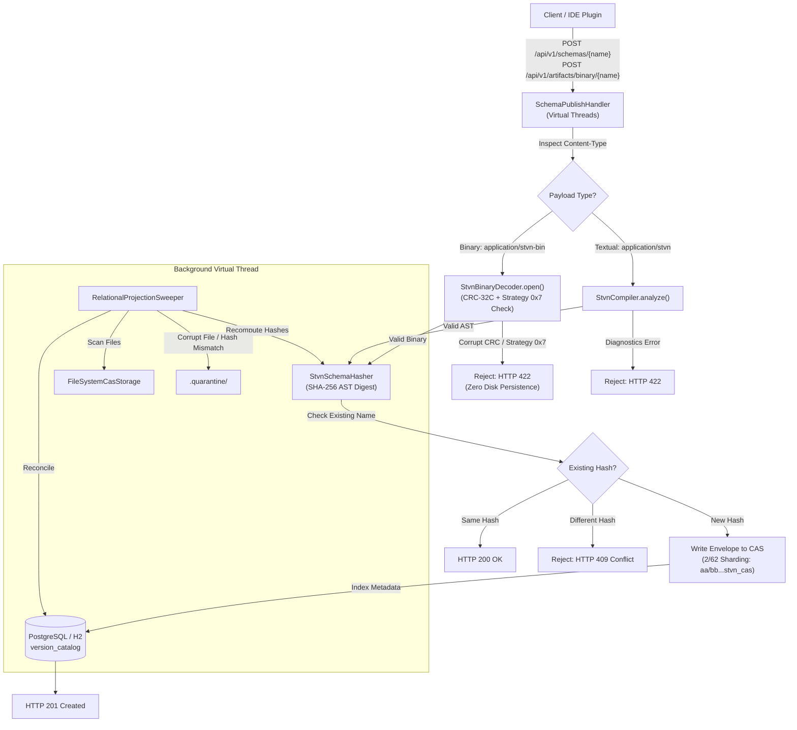

# STVN Schema Repository Server (`stvnadore-repository`)

[](https://github.com/chaotic3quilibrium/stvnadore-repository/blob/main/docs/architecture/01_STVN_SCHEMA_REPOSITORY_OVERVIEW.md)
[](https://openjdk.org/projects/jdk/21/)
[](https://javalin.io/)
[]()
[]()

Production Content-Addressable Storage (CAS) and Relational Schema Catalog service for Strongly Typed Value Notation (STVN). The server exposes a high-throughput, non-blocking REST API powered by Javalin 6 and Java 21 Virtual Threads, backed by PostgreSQL (or embedded H2) and a deterministic 2/62 filesystem CAS store.

---

- Version: 1.1.0 - 2026.09.06

---

# Table of Contents <!-- omit in toc -->

<!-- TOC -->
* [STVN Schema Repository Server (`stvnadore-repository`)](#stvn-schema-repository-server-stvnadore-repository)
* [Table of Contents <!-- omit in toc -->](#table-of-contents----omit-in-toc---)
  * [Architecture Overview](#architecture-overview)
  * [REST API Specification](#rest-api-specification)
    * [Media Type Standard](#media-type-standard)
    * [1. Publish Schema (Dual-Mode Text or Binary)](#1-publish-schema-dual-mode-text-or-binary)
      * [Response Status Codes:](#response-status-codes)
      * [Example Request:](#example-request)
      * [Example 201 Response Body:](#example-201-response-body)
    * [2. Publish Binary Artifact (Dedicated Route)](#2-publish-binary-artifact-dedicated-route)
      * [Response Status Codes:](#response-status-codes-1)
      * [Example Request:](#example-request-1)
    * [3. Lookup Schema by Shape Signature](#3-lookup-schema-by-shape-signature)
      * [Example Request:](#example-request-2)
    * [4. Retrieve Raw CAS Payload by Hash](#4-retrieve-raw-cas-payload-by-hash)
      * [Example Request:](#example-request-3)
    * [5. HTTP Error Mapping Taxonomy](#5-http-error-mapping-taxonomy)
  * [Zero-Trust Ingress Boundary Verification & Wire Governance](#zero-trust-ingress-boundary-verification--wire-governance)
    * [Byte 4 Control Byte Layout](#byte-4-control-byte-layout)
    * [Hardware-Accelerated CRC-32C Verification](#hardware-accelerated-crc-32c-verification)
  * [Storage & CAS Topology](#storage--cas-topology)
    * [2/62 Sharding Layout](#262-sharding-layout)
    * [Envelope Framing Format](#envelope-framing-format)
    * [Enum Subset CAS Hashing Invariants & Non-Collision Guarantees](#enum-subset-cas-hashing-invariants--non-collision-guarantees)
  * [Configuration & Environment Variables](#configuration--environment-variables)
  * [Building and Running](#building-and-running)
    * [Build with Maven](#build-with-maven)
    * [Local Execution with Embedded H2](#local-execution-with-embedded-h2)
    * [Production Execution with PostgreSQL & Docker](#production-execution-with-postgresql--docker)
* [Support](#support)
  * [License](#license)
    * [GNU AFFERO GENERAL PUBLIC LICENSE](#gnu-affero-general-public-license)
    * [REALLY HATE the GNU AFFERO GENERAL PUBLIC LICENSE, a.k.a. AGPLv3?](#really-hate-the-gnu-affero-general-public-license-aka-agplv3)
    * [FYI, I'd prefer to move stvnadore-core to an Apache 2.0 license](#fyi-id-prefer-to-move-stvnadore-core-to-an-apache-20-license)
    * [I'm not looking to win the lottery, I just don't want to work for free](#im-not-looking-to-win-the-lottery-i-just-dont-want-to-work-for-free)
* [Version History](#version-history)
  * [v1.1.0](#v110)
  * [v1.0.2](#v102)
<!-- TOC -->

---

## Architecture Overview

The STVN Schema Repository separates content storage from relational query indexing:

1. **Content-Addressable Storage (CAS)**: Immutable schema sources are stored as enveloped `.stvn_cas` files sharded by their 32-byte SHA-256 hex digest (2-character directory prefix + 62-character filename).
2. **Relational Version Catalog**: PostgreSQL/H2 tables (`version_catalog`, `schema_source_audit`) map human-readable schema names and structural shape signatures to cryptographic CAS hashes.
3. **Virtual Thread Execution**: Every incoming HTTP request is dispatched on an unpinned Java 21 Virtual Thread.
4. **Zero-Trust Ingress Boundary Verification**: The edge layer inspects binary payloads prior to persistence. The edge verifies magic bytes, enforces Byte 4 Bit 7 CRC-32C trailer integrity using hardware acceleration, and rejects Byte 4 Bits 6..4 Strategy Sentinel `0x7`.
5. **Enum Subset Fingerprinting**: The compiler digests nominal enum subset views (`#filterIncl`, `#filterExcl`) into unique CAS addresses, preventing hash collisions with parent enums or sibling subsets.
6. **Relational Projection Sweeper**: A background virtual thread periodically scans the CAS directory, recomputes AST hashes using `StvnSchemaHasher`, reconciles missing index entries, and isolates corrupt files to `.quarantine/`.



---

## REST API Specification

### Media Type Standard
Schema payload bodies must use the MIME Content-Type: `application/stvn` (for textual schemas) or `application/stvn-bin` / `application/octet-stream` (for binary schemas).

---

### 1. Publish Schema (Dual-Mode Text or Binary)
Stores and indexes a canonical STVN schema. Mutations to an existing schema name with a different cryptographic hash produce an `HTTP 409 Conflict`.

The endpoint supports dual-mode content negotiation:
* When `Content-Type: application/stvn` is supplied, the handler parses the request body as textual STVN source code.
* When `Content-Type: application/stvn-bin` or `application/octet-stream` is supplied, the handler invokes the zero-trust binary verification pipeline.

* **Method**: `POST`
* **Path**: `/api/v1/schemas/{name}`
* **Headers**: `Content-Type: application/stvn` OR `Content-Type: application/stvn-bin`
* **Request Body**: Raw STVN schema source text OR compiled binary stream (`.stvn_bin`).

#### Response Status Codes:
* `201 Created`: Schema successfully published and indexed.
* `200 OK`: Idempotent publication (exact schema name and hash already exist).
* `202 Accepted`: CAS write succeeded; relational indexing deferred to background sweeper.
* `400 Bad Request`: Empty binary payload or invalid STVN magic bytes.
* `409 Conflict`: Schema name exists with a different hash. Mutations are prohibited.
* `415 Unsupported Media Type`: Request `Content-Type` is missing or unsupported.
* `422 Unprocessable Entity`: STVN compilation diagnostics reported syntax/semantic errors, buffer size is under 9 bytes with CRC trailer enabled, CRC-32C checksum mismatch detected, or reserved strategy sentinel `0x7` detected.

#### Example Request:
```bash
curl -X POST http://localhost:8080/api/v1/schemas/UserProfile \
  -H "Content-Type: application/stvn" \
  --data-binary @user_profile.stvn_inclf
```

#### Example 201 Response Body:
```json
{
  "schemaName": "UserProfile",
  "shapeSignature": ":Tuple( :Int64 :StringNonEmpty :Option( :String ) )",
  "casHash": "e3b0c44298fc1c149afbf4c8996fb92427ae41e4649b934ca495991b7852b855"
}
```

---

### 2. Publish Binary Artifact (Dedicated Route)
Directly ingests and verifies compiled STVN binary payloads (`.stvn_bin`). The route enforces zero-trust ingress stream verification prior to writing any data to CAS storage.

* **Method**: `POST`
* **Path**: `/api/v1/artifacts/binary/{name}`
* **Headers**: `Content-Type: application/stvn-bin` (or `application/octet-stream`)
* **Request Body**: Raw binary stream containing the 4-byte `"STVN"` magic header, Byte 4 control byte, payload body, and optional Little-Endian CRC-32C trailer.

#### Response Status Codes:
* `201 Created`: Binary payload verified and stored in CAS.
* `200 OK`: Idempotent publication (exact binary hash already registered).
* `400 Bad Request`: Binary payload is empty (`0 bytes`) or magic header is corrupt.
* `409 Conflict`: Schema name exists with a divergent CAS hash.
* `422 Unprocessable Entity`: CRC-32C trailer verification failed, payload truncated below 9 bytes, or reserved strategy sentinel `0x7` detected.

#### Example Request:
```bash
curl -X POST http://localhost:8080/api/v1/artifacts/binary/UserProfileBinary \
  -H "Content-Type: application/stvn-bin" \
  --data-binary @user_profile.stvn_bin
```

---

### 3. Lookup Schema by Shape Signature
Queries metadata for a schema matching a specific nominal name and flattened structural shape signature.

* **Method**: `GET`
* **Path**: `/api/v1/schemas/{name}/shapes/{signature}`
* **Response Status Codes**:
  * `200 OK`: Match found. Returns JSON metadata.
  * `404 Not Found`: No matching schema name and shape signature found.

#### Example Request:
```bash
curl -X GET "http://localhost:8080/api/v1/schemas/UserProfile/shapes/%3ATuple(%20%3AInt64%20%3AStringNonEmpty%20)"
```

---

### 4. Retrieve Raw CAS Payload by Hash
Fetches the immutable, raw STVN schema content directly by its 64-character SHA-256 CAS hash.

* **Method**: `GET`
* **Path**: `/api/v1/schemas/cas/{hash}`
* **Response Status Codes**:
  * `200 OK`: Content returned with `Content-Type: application/stvn`.
  * `400 Bad Request`: Hash parameter is not a 64-character hex string.
  * `404 Not Found`: Hash does not exist in CAS storage.

#### Example Request:
```bash
curl -X GET http://localhost:8080/api/v1/schemas/cas/e3b0c44298fc1c149afbf4c8996fb92427ae41e4649b934ca495991b7852b855
```

---

### 5. HTTP Error Mapping Taxonomy
The repository uses explicit HTTP status codes to distinguish client transport errors, framing violations, and semantic failures:

| Status Code | Status Name            | Trigger Condition                                                                                                                    | Source Exception                                                                                     | Response Structure                                                                        |
|:------------|:-----------------------|:-------------------------------------------------------------------------------------------------------------------------------------|:-----------------------------------------------------------------------------------------------------|:------------------------------------------------------------------------------------------|
| `400`       | Bad Request            | Empty payload body, invalid magic header (`!= "STVN"`), or invalid CAS hash string length (`!= 64 hex chars`).                       | `IllegalArgumentException`                                                                           | `{"error": "Bad Request", "message": "..."}`                                              |
| `404`       | Not Found              | Schema shape signature not found in catalog, or CAS file missing on disk.                                                            | `Optional.empty()`                                                                                   | Empty body                                                                                |
| `409`       | Conflict               | Schema name already registered with a different cryptographic hash. Mutations are prohibited.                                        | `PublishResult.SchemaConflict`                                                                       | `{"error": "Conflict", "message": "Schema name '...' already exists..."}`                 |
| `415`       | Unsupported Media Type | Missing `Content-Type` header or header value not recognized (`!= application/stvn` or `application/stvn-bin`).                      | Content type guard                                                                                   | `{"error": "Unsupported Media Type", "message": "..."}`                                   |
| `422`       | Unprocessable Entity   | AST compiler diagnostics, CRC-32C trailer mismatch, stream size under 9 bytes with CRC enabled, or strategy sentinel `0x7` detected. | `PublishResult.ValidationError`, `MalformedPayloadException`, `UnsupportedEncodingStrategyException` | List of `CompileDiagnostic` objects or `{"error": "Malformed Payload", "message": "..."}` |
| `200`       | OK                     | Idempotent publication. Schema name and hash match existing registration.                                                            | `PublishResult.IdempotentCollision`                                                                  | `SchemaMetadata` JSON object                                                              |
| `201`       | Created                | Schema validated, persisted to CAS storage, and cataloged.                                                                           | `PublishResult.Success`                                                                              | `SchemaMetadata` JSON object                                                              |
| `202`       | Accepted               | CAS write succeeded; relational database indexing deferred to background sweeper.                                                    | `PublishResult.IndexingDeferred`                                                                     | `SchemaMetadata` JSON object                                                              |

---

## Zero-Trust Ingress Boundary Verification & Wire Governance

### Byte 4 Control Byte Layout
All incoming binary streams start with a 4-byte magic sequence (`0x53 0x54 0x56 0x4E`, ASCII `"STVN"`), followed immediately by Byte 4 (the Control Byte):

```
Bit 7           Bit 6   Bit 5   Bit 4   Bit 3   Bit 2   Bit 1   Bit 0
+---------------+-----------------------+-------------------------------+
| HAS_TRAILER   |   WIRE STRATEGY       |   SCHEMA IDENTITY STRATEGY    |
| (0x80)        |   (0x70)              |   (0x0F)                      |
+---------------+-----------------------+-------------------------------+
```

* **Bit 7 (`0x80 HAS_TRAILER_CRC32C`):** When set to `1`, a 4-byte Little-Endian CRC-32C trailer is present at the end of the stream (`buffer.limit() - 4`).
* **Bits 6..4 (`0x70 WIRE STRATEGY`):** Defines the structural layout strategy. Value `0x0` specifies `ZERO_COPY_POST_ORDER`. Sentinel value `0x7` represents a multi-byte header extension. The server rejects strategy `0x7` with `HTTP 422 Unsupported Encoding Strategy`.
* **Bits 3..0 (`0x0F SCHEMA IDENTITY STRATEGY`):** Identifies how schema metadata attaches (`0x0` Universal Default, `0x1` Explicit SHA-256, `0x2` Self-Describing Schema).

### Hardware-Accelerated CRC-32C Verification
When Byte 4 Bit 7 is set:
1. The buffer length must be at least 9 bytes (5 header bytes + 4 trailer bytes). Truncated buffers fail immediately.
2. The verifier initializes `java.util.zip.CRC32C`, leveraging hardware CPU intrinsics (SSE4.2 on x86-64, ARMv8 CRC instructions on aarch64).
3. The verifier computes the checksum over bytes `0..(limit - 4)`.
4. The verifier reads the expected checksum from the final 4 bytes using Little-Endian order:
   `int expectedCrc = buffer.getInt(limit - 4);`
5. If computed CRC does not equal expected CRC, `MalformedPayloadException` is thrown. The server returns `HTTP 422` and writes nothing to disk.

---

## Storage & CAS Topology

### 2/62 Sharding Layout
Files are written under `<CAS_ROOT>` using a two-character prefix directory to prevent filesystem inode saturation:

```
data/cas/
├── e3/
│   └── b0c44298fc1c149afbf4c8996fb92427ae41e4649b934ca495991b7852b855.stvn_cas
├── .quarantine/
│   └── b0c44298fc1c149afbf4c8996fb92427ae41e4649b934ca495991b7852b855.stvn_cas.1772398400000.HASH_MISMATCH.quarantine
```

### Envelope Framing Format
The physical `.stvn_cas` file encloses the canonical schema in a standard AST tuple envelope:
```stvn
(:Tuple "UserProfile" "e3b0c44298fc1c149afbf4c8996fb92427ae41e4649b934ca495991b7852b855" "{ :defs { :UserProfile :Tuple( :Int64 :String ) } }")
```

### Enum Subset CAS Hashing Invariants & Non-Collision Guarantees
STVN v1.1.0 introduces nominal enum subset views (`#filterIncl`, `#filterExcl`). In prior versions, structural hashing could generate identical CAS digests for a subset and its parent enum.

`StvnSchemaHasher` digests all subset attributes in sequential order:
1. `subsetName:<name>`
2. `subsetParent:<parentType>`
3. `subsetRoot:<rootEnum>`
4. `subsetFilterType:<incl|excl>`
5. `subsetVariant:<variant>` (for each allowed variant in sorted relative declaration order)

Because all metadata feeds into `MessageDigest("SHA-256")`:
$$\text{CAS}(:\text{Status}) \ne \text{CAS}(:\text{ActiveStatus}) \ne \text{CAS}(:\text{NonDeleted})$$

This cryptographic property guarantees:
* An enum subset never overwrites its parent enum in physical `2/62` CAS storage.
* Sibling subsets with different variant selections produce divergent CAS files.
* Transitive derivation chains (`:ExecutionStatus` $\to$ `:WorkableStatus` $\to$ `:ActiveStatus` $\to$ `:TaskStatus`) retain unique fingerprints throughout the derivation tree.

---

## Configuration & Environment Variables

| Variable       | Default Value                                | Description                                                  |
|:---------------|:---------------------------------------------|:-------------------------------------------------------------|
| `CAS_ROOT`     | `data/cas`                                   | Root directory for 2/62 physical CAS storage.                |
| `DB_URL`       | `jdbc:postgresql://localhost:5432/stvnadore` | JDBC connection URL (PostgreSQL or H2).                      |
| `DB_USER`      | `postgres`                                   | Database connection username.                                |
| `DB_PASSWORD`  | `password`                                   | Database connection password.                                |
| `DB_AUTO_INIT` | `false`                                      | When `true`, automatically executes `schema.sql` on startup. |

---

## Building and Running

### Build with Maven
```bash
./mvnw clean compile
./mvnw test
```

### Local Execution with Embedded H2
```bash
export DB_URL="jdbc:h2:mem:stvnadore;MODE=PostgreSQL;DATABASE_TO_LOWER=TRUE"
export DB_AUTO_INIT="true"
export CAS_ROOT="target/cas_data"
./mvnw exec:java -Dexec.mainClass="org.stvnadore.repository.RepositoryApplication"
```

### Production Execution with PostgreSQL & Docker
```bash
# 1. Start PostgreSQL
docker run --name stvn-postgres -e POSTGRES_DB=stvnadore -e POSTGRES_PASSWORD=password -p 5432:5432 -d postgres:16-alpine

# 2. Run Repository Server
export DB_URL="jdbc:postgresql://localhost:5432/stvnadore"
export DB_USER="postgres"
export DB_PASSWORD="password"
export DB_AUTO_INIT="true"
./mvnw exec:java -Dexec.mainClass="org.stvnadore.repository.RepositoryApplication"
```

---

# Support

**Website:** <https://github.com/chaotic3quilibrium/stvnadore-repository>

**Email:** [jim.oflaherty.jr@gmail.com](mailto:jim.oflaherty.jr+srrms@gmail.com)

---

## License

### [GNU AFFERO GENERAL PUBLIC LICENSE](https://github.com/chaotic3quilibrium/stvnadore-core/blob/main/LICENSE.md)

The stvnadore-repository files are free software: you can redistribute it and/or modify it under the terms of the GNU Affero General Public License as published by the Free Software Foundation, either version 3 of the License, or (at your option) any later version.

This program is distributed in the hope that it will be useful, but WITHOUT ANY WARRANTY; without even the implied warranty of MERCHANTABILITY or FITNESS FOR A PARTICULAR PURPOSE. See the GNU Affero General Public License for more details.

You should have received a copy of the [GNU Affero General Public License](https://www.gnu.org/licenses/agpl-3.0.en.html) along with this program. If not, see <https://www.gnu.org/licenses/>.

---

### REALLY HATE the GNU AFFERO GENERAL PUBLIC LICENSE, a.k.a. AGPLv3?

- It was chosen entirely because of Amazon's/AWS's (and many other wealthy corporations) historic abuses and exploitation of FOSS (Free Open Source Software)
- No Worries, I'd Love to Work with You

If the AGPLv3 doesn't work for you, I would LOVE to work with you to generate a **custom/different/commercial/non-profit/government license** for stvnadore-core.

Please email: <jim.oflaherty.jr+srrml@gmail.com>, letting us know what license you would prefer. I am happy to discuss this with you.

---

### FYI, I'd prefer to move stvnadore-core to an Apache 2.0 license

---

### I'm not looking to win the lottery, I just don't want to work for free

---

# Version History

## v1.1.0

- 2026.09.06
- Implemented enum subset filtering with transitive chaining
- Added Control Byte 4 bitwise partitioning (1:3:4) for CRC-32C, SchemaIdentityStrategy, and BinaryEncodingStrategy

## v1.0.2

- 2026.09.04
- Initial release across all four repositories
