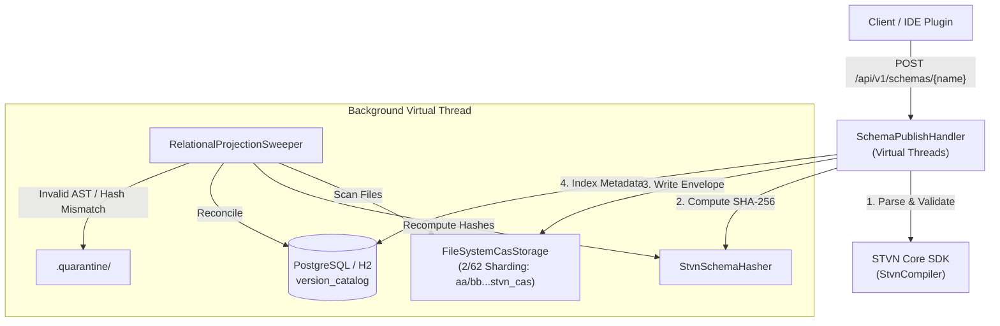

# STVN Schema Repository Server (`stvnadore-repository`)

[](https://github.com/chaotic3quilibrium/stvnadore-repository/tree/main/docs/architecture/01_STVN_SCHEMA_REPOSITORY_OVERVIEW.md)
[](https://openjdk.org/projects/jdk/21/)
[](https://javalin.io/)
[]()
[]()

Production Content-Addressable Storage (CAS) and Relational Schema Catalog service for Strongly Typed Value Notation (STVN). The server exposes a high-throughput, non-blocking REST API powered by Javalin 6 and Java 21 Virtual Threads, backed by PostgreSQL (or embedded H2) and a deterministic 2/62 filesystem CAS store.

---

- Version: 1.0.0 - 2026.08.31

---

# Table of Contents <!-- omit in toc -->

<!-- TOC -->
* [STVN Schema Repository Server (`stvnadore-repository`)](#stvn-schema-repository-server-stvnadore-repository)
* [Table of Contents <!-- omit in toc -->](#table-of-contents----omit-in-toc---)
  * [Architecture Overview](#architecture-overview)
  * [REST API Specification](#rest-api-specification)
    * [Media Type Standard](#media-type-standard)
    * [1. Publish Schema](#1-publish-schema)
      * [Response Status Codes:](#response-status-codes)
      * [Example Request:](#example-request)
      * [Example 201 Response Body:](#example-201-response-body)
    * [2. Lookup Schema by Shape Signature](#2-lookup-schema-by-shape-signature)
      * [Example Request:](#example-request-1)
    * [3. Retrieve Raw CAS Payload by Hash](#3-retrieve-raw-cas-payload-by-hash)
      * [Example Request:](#example-request-2)
  * [Storage & CAS Topology](#storage--cas-topology)
    * [2/62 Sharding Layout](#262-sharding-layout)
    * [Envelope Framing Format](#envelope-framing-format)
  * [Configuration & Environment Variables](#configuration--environment-variables)
  * [Building and Running](#building-and-running)
    * [Build with Maven](#build-with-maven)
    * [Local Execution with Embedded H2](#local-execution-with-embedded-h2)
    * [Production Execution with PostgreSQL & Docker](#production-execution-with-postgresql--docker)
* [Support](#support)
  * [License](#license)
    * [GNU AFFERO GENERAL PUBLIC LICENSE](#gnu-affero-general-public-license)
    * [REALLY HATE the GNU AFFERO GENERAL PUBLIC LICENSE, a.k.a. AGPLv3?](#really-hate-the-gnu-affero-general-public-license-aka-agplv3)
    * [FYI, I'd prefer to move stvnadore-repository to an Apache 2.0 license](#fyi-id-prefer-to-move-stvnadore-repository-to-an-apache-20-license)
    * [I'm not looking to win the lottery, I just don't want to work for free](#im-not-looking-to-win-the-lottery-i-just-dont-want-to-work-for-free)
<!-- TOC -->

---

## Architecture Overview

The STVN Schema Repository separates content storage from relational query indexing:

1. **Content-Addressable Storage (CAS)**: Immutable schema sources are stored as enveloped `.stvn_cas` files sharded by their 32-byte SHA-256 hex digest (2-character directory prefix + 62-character filename).
2. **Relational Version Catalog**: PostgreSQL/H2 tables (`version_catalog`, `schema_source_audit`) map human-readable schema names and structural shape signatures to cryptographic CAS hashes.
3. **Virtual Thread Execution**: Every incoming HTTP request is dispatched on an unpinned Java 21 Virtual Thread.
4. **Relational Projection Sweeper**: A background virtual thread periodically scans the CAS directory, recomputes AST hashes using `StvnSchemaHasher`, reconciles missing index entries, and isolates corrupt files to `.quarantine/`.



---

## REST API Specification

### Media Type Standard
All schema payload bodies must use the MIME Content-Type: `application/stvn`.

---

### 1. Publish Schema
Stores and indexes a new canonical STVN schema. Mutations to an existing schema name with a different cryptographic hash are rejected.

* **Method**: `POST`
* **Path**: `/api/v1/schemas/{name}`
* **Headers**: `Content-Type: application/stvn`
* **Request Body**: Raw STVN schema source code.

#### Response Status Codes:
* `201 Created`: Schema successfully published and indexed.
* `200 OK`: Idempotent publication (exact schema name and hash already exist).
* `202 Accepted`: CAS write succeeded; relational indexing deferred to background sweeper.
* `409 Conflict`: Schema name exists with a different hash. Mutations are prohibited.
* `415 Unsupported Media Type`: Request `Content-Type` is not `application/stvn`.
* `422 Unprocessable Entity`: STVN compilation diagnostics reported syntax or semantic errors.

#### Example Request:
```bash
curl -X POST http://localhost:8080/api/v1/schemas/UserProfile \
  -H "Content-Type: application/stvn" \
  --data-binary @user_profile.stvn_inclf
```

#### Example 201 Response Body:
```json
{
  "schemaName": "UserProfile",
  "shapeSignature": ":Tuple( :Int64 :StringNonEmpty :Option( :String ) )",
  "casHash": "e3b0c44298fc1c149afbf4c8996fb92427ae41e4649b934ca495991b7852b855"
}
```

---

### 2. Lookup Schema by Shape Signature
Queries metadata for a schema matching a specific nominal name and flattened structural shape signature.

* **Method**: `GET`
* **Path**: `/api/v1/schemas/{name}/shapes/{signature}`
* **Response Status Codes**:
  * `200 OK`: Match found. Returns JSON metadata.
  * `404 Not Found`: No matching schema name and shape signature found.

#### Example Request:
```bash
curl -X GET "http://localhost:8080/api/v1/schemas/UserProfile/shapes/%3ATuple(%20%3AInt64%20%3AStringNonEmpty%20)"
```

---

### 3. Retrieve Raw CAS Payload by Hash
Fetches the immutable, raw STVN schema content directly by its 64-character SHA-256 CAS hash.

* **Method**: `GET`
* **Path**: `/api/v1/schemas/cas/{hash}`
* **Response Status Codes**:
  * `200 OK`: Content returned with `Content-Type: application/stvn`.
  * `400 Bad Request`: Hash parameter is not a 64-character hex string.
  * `404 Not Found`: Hash does not exist in CAS storage.

#### Example Request:
```bash
curl -X GET http://localhost:8080/api/v1/schemas/cas/e3b0c44298fc1c149afbf4c8996fb92427ae41e4649b934ca495991b7852b855
```

---

## Storage & CAS Topology

### 2/62 Sharding Layout
Files are written under `<CAS_ROOT>` using a two-character prefix directory to prevent filesystem inode saturation:

```
data/cas/
├── e3/
│   └── b0c44298fc1c149afbf4c8996fb92427ae41e4649b934ca495991b7852b855.stvn_cas
├── .quarantine/
│   └── b0c44298fc1c149afbf4c8996fb92427ae41e4649b934ca495991b7852b855.stvn_cas.1772398400000.HASH_MISMATCH.quarantine
```

### Envelope Framing Format
The physical `.stvn_cas` file encloses the canonical schema in a standard AST tuple envelope:
```stvn
(:Tuple "UserProfile" "e3b0c44298fc1c149afbf4c8996fb92427ae41e4649b934ca495991b7852b855" "{ :defs { :UserProfile :Tuple( :Int64 :String ) } }")
```

---

## Configuration & Environment Variables

| Variable       | Default Value                                | Description                                                  |
|:---------------|:---------------------------------------------|:-------------------------------------------------------------|
| `CAS_ROOT`     | `data/cas`                                   | Root directory for 2/62 physical CAS storage.                |
| `DB_URL`       | `jdbc:postgresql://localhost:5432/stvnadore` | JDBC connection URL (PostgreSQL or H2).                      |
| `DB_USER`      | `postgres`                                   | Database connection username.                                |
| `DB_PASSWORD`  | `password`                                   | Database connection password.                                |
| `DB_AUTO_INIT` | `false`                                      | When `true`, automatically executes `schema.sql` on startup. |

---

## Building and Running

### Build with Maven
```bash
./mvnw clean compile
./mvnw test
```

### Local Execution with Embedded H2
```bash
export DB_URL="jdbc:h2:mem:stvnadore;MODE=PostgreSQL;DATABASE_TO_LOWER=TRUE"
export DB_AUTO_INIT="true"
export CAS_ROOT="target/cas_data"
./mvnw exec:java -Dexec.mainClass="org.stvnadore.repository.RepositoryApplication"
```

### Production Execution with PostgreSQL & Docker
```bash
# 1. Start PostgreSQL
docker run --name stvn-postgres -e POSTGRES_DB=stvnadore -e POSTGRES_PASSWORD=password -p 5432:5432 -d postgres:16-alpine

# 2. Run Repository Server
export DB_URL="jdbc:postgresql://localhost:5432/stvnadore"
export DB_USER="postgres"
export DB_PASSWORD="password"
export DB_AUTO_INIT="true"
./mvnw exec:java -Dexec.mainClass="org.stvnadore.repository.RepositoryApplication"
```

---

# Support

**Website:** <https://github.com/chaotic3quilibrium/stvnadore-repository>

**Email:** [jim.oflaherty.jr@gmail.com](mailto:jim.oflaherty.jr+srrms@gmail.com)

---

## License

### [GNU AFFERO GENERAL PUBLIC LICENSE](https://github.com/chaotic3quilibrium/stvnadore-repository/blob/main/LICENSE.md)

The stvnadore-repository files are free software: you can redistribute it and/or modify it under the terms of the GNU Affero General Public License as published by the Free Software Foundation, either version 3 of the License, or (at your option) any later version.

This program is distributed in the hope that it will be useful, but WITHOUT ANY WARRANTY; without even the implied warranty of MERCHANTABILITY or FITNESS FOR A PARTICULAR PURPOSE. See the GNU Affero General Public License for more details.

You should have received a copy of the [GNU Affero General Public License](https://www.gnu.org/licenses/agpl-3.0.en.html) along with this program. If not, see <https://www.gnu.org/licenses/>.

---

### REALLY HATE the GNU AFFERO GENERAL PUBLIC LICENSE, a.k.a. AGPLv3?

- It was chosen entirely because of Amazon's/AWS's (and many other wealthy corporations) historic abuses and exploitation of FOSS (Free Open Source Software)
- No Worries, I'd Love to Work with You

If the AGPLv3 doesn't work for you, I would LOVE to work with you to generate a **custom/different/commercial/non-profit/government license** for stvnadore-repository.

Please email: <jim.oflaherty.jr+srrml@gmail.com>, letting us know what license you would prefer. I am happy to discuss this with you.

---

### FYI, I'd prefer to move stvnadore-repository to an Apache 2.0 license

---

### I'm not looking to win the lottery, I just don't want to work for free