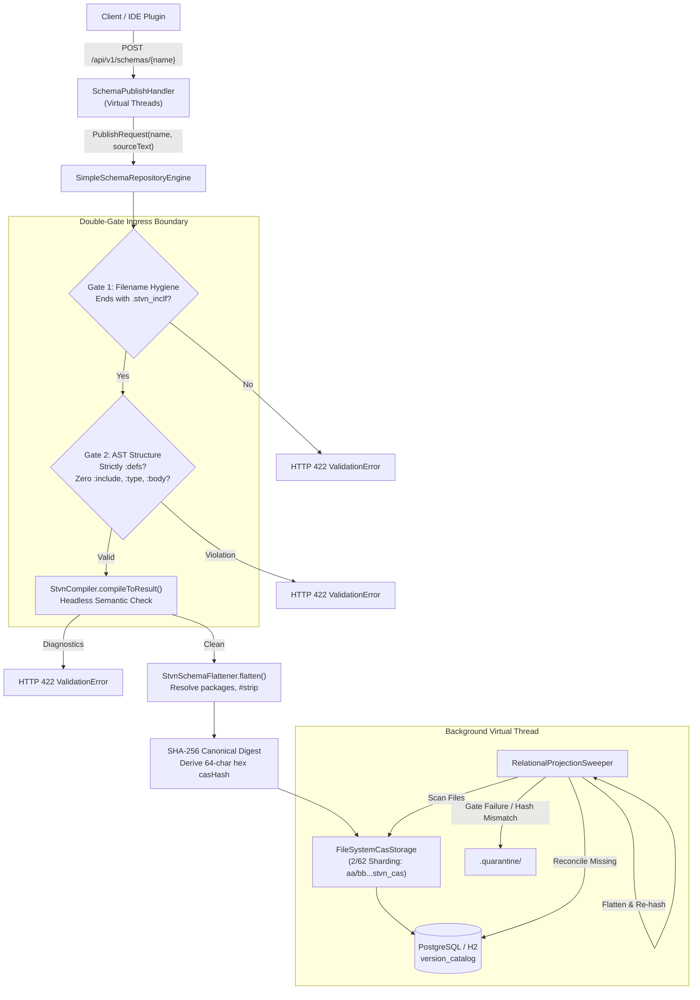

# STVN Architectural Specification: Schema Repository Server Overview

- **Document ID**: STVN-SPEC-REPO-01
- **Status**: Canonical Specification
- **Version**: 1.2.0
- **Compliance**: Mandatory for all STVN ecosystem server implementations.

---

**Table of Contents**

<!-- TOC -->
* [STVN Architectural Specification: Schema Repository Server Overview](#stvn-architectural-specification-schema-repository-server-overview)
  * [1. Purpose & Core Responsibilities](#1-purpose--core-responsibilities)
  * [2. Double-Gate Ingress Boundary](#2-double-gate-ingress-boundary)
    * [Gate 1: Filename Extension Hygiene](#gate-1-filename-extension-hygiene)
    * [Gate 2: AST Structure Invariant](#gate-2-ast-structure-invariant)
    * [Headless Compilation & Canonical Flattening](#headless-compilation--canonical-flattening)
  * [3. Content-Addressable Storage (CAS) Specification](#3-content-addressable-storage-cas-specification)
    * [2/62 Filesystem Sharding Layout](#262-filesystem-sharding-layout)
    * [Enum Subset CAS Invariant](#enum-subset-cas-invariant)
    * [CAS Envelope Document Format](#cas-envelope-document-format)
  * [4. Relational Schema Catalog (PostgreSQL & H2)](#4-relational-schema-catalog-postgresql--h2)
    * [Table: version_catalog](#table-version_catalog)
    * [Table: schema_source_audit](#table-schema_source_audit)
  * [5. REST API Specification](#5-rest-api-specification)
    * [1. Publish Schema (Dual-Mode Text or Binary)](#1-publish-schema-dual-mode-text-or-binary)
    * [2. Publish Binary Artifact (Dedicated Route)](#2-publish-binary-artifact-dedicated-route)
    * [3. Lookup Schema by Shape Signature](#3-lookup-schema-by-shape-signature)
    * [4. Retrieve Raw CAS Schema Payload](#4-retrieve-raw-cas-schema-payload)
    * [5. HTTP Error Mapping Taxonomy](#5-http-error-mapping-taxonomy)
  * [6. Background Projection Sweeper & Quarantine Pipeline](#6-background-projection-sweeper--quarantine-pipeline)
    * [Forensic Quarantine Reason Taxonomy](#forensic-quarantine-reason-taxonomy)
<!-- TOC -->

---

## 1. Purpose & Core Responsibilities

The STVN Schema Repository is a high-throughput, non-blocking Content-Addressable Storage (CAS) and Relational Schema Catalog service. It provides:

1. **Double-Gate Ingress Boundary**: Strictly enforces filename hygiene (`.stvn_inclf`) and AST structure invariants (`:defs` only, zero `:include`, zero `:type`, zero `:body`) on all inbound schemas.
2. **Headless Semantic Compilation**: Validates schema definitions without requiring a document body payload using `StvnCompiler.compileToResult()`.
3. **Canonical AST Flattening & CAS Digesting**: Expands `:package` enclosures into Fully Qualified Nominal Identifiers (FQNIs), applies unary `#strip`, derives structural shape signatures, and hashes the canonical output via SHA-256.
4. **Content-Addressable Storage (CAS)**: Cryptographically deterministic, immutable storage for `.stvn_cas` schema envelopes sharded across the filesystem using a 2/62 prefix/suffix partitioning layout.
5. **Relational Version Catalog**: Fast query indexing mapping nominal schema names and flattened structural shape signatures to cryptographic CAS content hashes.
6. **Strict Immutability Invariant**: Schema mutations are strictly prohibited. Publishing an existing schema name with a different cryptographic hash produces an HTTP 409 Conflict.
7. **Zero-Trust Binary Ingress Boundary**: Incoming binary streams undergo hardware-accelerated CRC-32C trailer verification and Byte 4 wire governance prior to storage commitment.
8. **Self-Healing Background Projection Sweeper**: A background virtual thread asynchronously scans the physical CAS directory, re-validates Double-Gate invariants, recalculates SHA-256 CAS hashes from flattened shapes, reconciles missing index entries, and relocates invalid files to `.quarantine/`.



---

## 2. Double-Gate Ingress Boundary

### Gate 1: Filename Extension Hygiene
All incoming flat schemas must strictly carry the `.stvn_inclf` filename suffix:
* `schemaName.endsWith(".stvn_inclf")` is asserted at the ingress perimeter.
* Violations immediately return `PublishResult.ValidationError` (HTTP 422) with diagnostic message `ERR_MALFORMED_SCHEMA_IN_ENVELOPE`.

### Gate 2: AST Structure Invariant
Flat schema documents stored in CAS serve as standalone, headless include definitions:
* The root document context must contain strictly a `:defs` section.
* Top-level `:type` and `:body` sections are strictly prohibited.
* Embedded `:include` directives are strictly prohibited in flat schemas (`ERR_INCLUDES_PROHIBITED_IN_FLAT_DOCUMENT`).

### Headless Compilation & Canonical Flattening
* Ingress validation compiles schemas without requiring a payload body via `StvnCompiler.compileToResult(sourceText, schemaName, StvnParserConfig.STRICT)`.
* `StvnSchemaFlattener.flatten(Map.of(schemaName, sourceText), schemaName)` resolves `:package` enclosures into Fully Qualified Nominal Identifiers (FQNIs), applies unary `#strip`, and sorts definitions alphabetically.
* The 64-character lowercase hexadecimal CAS address is computed as:
  $$\text{CAS Hash} = \text{SHA-256}(\text{shapeSignature.getBytes(StandardCharsets.UTF\_8)})$$

---

## 3. Content-Addressable Storage (CAS) Specification

### 2/62 Filesystem Sharding Layout
All schemas are written to disk using their 64-character lowercase hexadecimal SHA-256 AST hash:
* **Directory Prefix (2 hex characters)**: `data/cas/<hash[0..2]>/`
* **Filename (62 hex characters + extension)**: `<hash[2..64]>.stvn_cas`
* **Example Path**: `data/cas/ba/7816bf8f01cfea414140de5dae2223b00361a396177a9cb410ff61f20015ad.stvn_cas`

### Enum Subset CAS Invariant
The canonical shape flattener normalizes enum subset metadata (`#filterIncl`, `#filterExcl`, variant lists) into the deterministic shape signature. This guarantees:
$$\text{CAS}(:\text{RootEnum}) \ne \text{CAS}(:\text{SubsetEnum})$$
Physical CAS envelopes for subsets and parents remain isolated under separate 2/62 sharded paths.

### CAS Envelope Document Format
Raw schema sources are wrapped in a canonical STVN tuple envelope:
```stvn
{
  :defs {
    :SchemaName :String
    :StvnInclf {#preserveIndent #T} :String
  }
  :type :Tuple(:SchemaName :StvnInclf)
  :body (
    "UserProfile.stvn_inclf"
    """[SHA256-ba7816bf8f01cfea414140de5dae2223b00361a396177a9cb410ff61f20015ad]
    :defs {
      :UserId :Uint64
      :UserName :StringNonEmpty
    }
    [SHA256-ba7816bf8f01cfea414140de5dae2223b00361a396177a9cb410ff61f20015ad]"""
  )
}
```

---

## 4. Relational Schema Catalog (PostgreSQL & H2)

### Table: version_catalog
| Column            | Type         | Constraints               | Description                                |
|:------------------|:-------------|:--------------------------|:-------------------------------------------|
| `schema_name`     | VARCHAR(256) | PRIMARY KEY               | Nominal schema identifier (`*.stvn_inclf`) |
| `shape_signature` | TEXT         | NOT NULL                  | Flattened AST structural shape signature   |
| `cas_hash`        | CHAR(64)     | NOT NULL, UNIQUE          | Cryptographic SHA-256 CAS address          |
| `created_at`      | TIMESTAMP    | DEFAULT CURRENT_TIMESTAMP | Initial registration timestamp             |

### Table: schema_source_audit
| Column         | Type         | Constraints               | Description                     |
|:---------------|:-------------|:--------------------------|:--------------------------------|
| `id`           | BIGSERIAL    | PRIMARY KEY               | Monotonic audit sequence number |
| `schema_name`  | VARCHAR(256) | NOT NULL                  | Schema name (`*.stvn_inclf`)    |
| `cas_hash`     | CHAR(64)     | NOT NULL                  | Content hash                    |
| `source_text`  | TEXT         | NOT NULL                  | Author-submitted source code    |
| `published_at` | TIMESTAMP    | DEFAULT CURRENT_TIMESTAMP | Publication timestamp           |

---

## 5. REST API Specification

### 1. Publish Schema (Dual-Mode Text or Binary)
* **Method**: `POST`
* **Path**: `/api/v1/schemas/{name}`
* **Headers**: `Content-Type: application/stvn` OR `application/stvn-bin`
* **Body**: Raw STVN schema source code (`.stvn_inclf`) or compiled binary frame (`.stvn_bin`).
* **Status Codes**:
  * `201 Created`: Schema successfully published and indexed.
  * `200 OK`: Idempotent publication (exact name and hash match).
  * `202 Accepted`: CAS write succeeded; relational indexing queued for background sweeper.
  * `400 Bad Request`: Empty binary payload or invalid STVN magic header bytes.
  * `409 Conflict`: Mutation rejected (name exists with different hash).
  * `415 Unsupported Media Type`: Request Content-Type is not supported.
  * `422 Unprocessable Entity`: Gate 1 violation (missing `.stvn_inclf`), Gate 2 violation (illegal includes, top-level body/type), compiler diagnostics detected, or binary verification failure.

### 2. Publish Binary Artifact (Dedicated Route)
* **Method**: `POST`
* **Path**: `/api/v1/artifacts/binary/{name}`
* **Headers**: `Content-Type: application/stvn-bin`
* **Body**: Compiled STVN binary payload stream.
* **Status Codes**:
  * `201 Created`: Binary payload verified and saved to CAS.
  * `200 OK`: Idempotent publication.
  * `400 Bad Request`: Payload empty or invalid STVN magic bytes.
  * `409 Conflict`: Mutation rejected (name exists with divergent hash).
  * `422 Unprocessable Entity`: Ingress verification failure (CRC-32C checksum mismatch, truncated buffer under 9 bytes, or strategy sentinel 0x7 detected).

### 3. Lookup Schema by Shape Signature
* **Method**: `GET`
* **Path**: `/api/v1/schemas/{name}/shapes/{signature}`
* **Status Codes**:
  * `200 OK`: Returns JSON `{"schemaName": "...", "shapeSignature": "...", "casHash": "..."}`.
  * `404 Not Found`: No schema registered with given name and shape.

### 4. Retrieve Raw CAS Schema Payload
* **Method**: `GET`
* **Path**: `/api/v1/schemas/cas/{hash}`
* **Header**: `Accept: application/stvn`
* **Status Codes**:
  * `200 OK`: Returns raw unwrapped schema source code (`Content-Type: application/stvn`).
  * `400 Bad Request`: Hash length is not 64 hexadecimal characters.
  * `404 Not Found`: CAS file not found on disk.

### 5. HTTP Error Mapping Taxonomy
| Status Code | Status Name            | Root Cause                                                                                    |
|:------------|:-----------------------|:----------------------------------------------------------------------------------------------|
| `400`       | Bad Request            | Empty payload, invalid STVN magic header bytes, or non-64 hex char hash.                      |
| `404`       | Not Found              | Schema shape signature or CAS hash not found.                                                 |
| `409`       | Conflict               | Schema name already registered with a different cryptographic hash.                           |
| `415`       | Unsupported Media Type | Missing or invalid Content-Type header.                                                       |
| `422`       | Unprocessable Entity   | Gate 1/2 violation, AST compilation error, CRC-32C mismatch, or strategy sentinel `0x7`.      |
| `200`       | OK                     | Idempotent duplicate submission.                                                              |
| `201`       | Created                | Successful schema registration and persistence.                                               |
| `202`       | Accepted               | CAS write succeeded; relational catalog update deferred to background sweeper.                |

---

## 6. Background Projection Sweeper & Quarantine Pipeline

The `RelationalProjectionSweeper` executes every 60 seconds on a Java 21 Virtual Thread:
1. Deep-walks the `data/cas/` directory, extracting all `.stvn_cas` filenames.
2. Checks if each CAS hash exists in `version_catalog`.
3. If missing:
   - Unpacks the envelope tuple via `StvnCasPackager`.
   - Enforces **Gate 1**: schema filename must end with `.stvn_inclf`.
   - Enforces **Gate 2**: inner source must contain strictly `:defs` with zero `:include`, `:type`, or `:body`.
   - Performs **Headless Validation**: verifies inner source compiles cleanly without diagnostics.
   - Derives canonical shape signature via `StvnSchemaFlattener.flatten()`.
   - Computes SHA-256 CAS address from the canonical shape signature.
   - Verifies computed hash strictly matches the CAS filename hash.
   - Inserts the missing index entry into `version_catalog` and `schema_source_audit`.
4. If an envelope fails any gate or verification step, the file is atomically relocated into:
   `data/cas/.quarantine/<filename>.<timestamp>.<REASON>.quarantine`

### Forensic Quarantine Reason Taxonomy
| Reason Tag                        | Verification Gate Trigger | Description                                                               |
|:----------------------------------|:--------------------------|:--------------------------------------------------------------------------|
| `EMPTY_PAYLOAD`                   | Storage I/O               | CAS file exists but contains 0 bytes.                                     |
| `CORRUPT_ENVELOPE`                | Outer Envelope            | Outer envelope fails STVN parser or is not a valid 2-element tuple.       |
| `INVALID_FILENAME_EXTENSION`      | Gate 1 Hygiene            | Embedded schema filename does not end with `.stvn_inclf`.                 |
| `MALFORMED_INNER_STRUCTURE`       | Gate 2 Structure          | Root document contains `:type` or `:body`, or lacks `:defs`.              |
| `ILLEGAL_INCLUDES_IN_FLAT_SCHEMA` | Gate 2 Structure          | Inner flat schema contains forbidden `:include` directive.                |
| `INVALID_INNER_AST`               | Headless Compilation      | Upstream STVN compiler reports syntax or type check errors.               |
| `FLATTENING_ERROR`                | Flattener Pipeline        | `StvnSchemaFlattener` fails to normalize definitions.                     |
| `HASH_MISMATCH`                   | Cryptographic CAS         | Recalculated SHA-256 shape hash does not match the 64-char filename hash. |