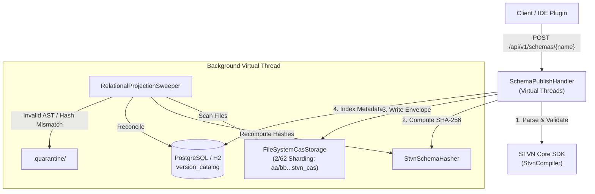

# STVN Architectural Specification: Schema Repository Server Overview

**Document ID**: STVN-SPEC-REPO-01
**Status**: Canonical Specification
**Version**: 1.1.0
**Compliance**: Mandatory for all STVN ecosystem server implementations.

---

# Table of Contents <!-- omit in toc -->

<!-- TOC -->
* [STVN Architectural Specification: Schema Repository Server Overview](#stvn-architectural-specification-schema-repository-server-overview)
* [Table of Contents <!-- omit in toc -->](#table-of-contents----omit-in-toc---)
  * [1. Purpose & Core Responsibilities](#1-purpose--core-responsibilities)
  * [2. Content-Addressable Storage (CAS) Specification](#2-content-addressable-storage-cas-specification)
    * [2/62 Filesystem Sharding Layout](#262-filesystem-sharding-layout)
    * [Enum Subset CAS Invariant](#enum-subset-cas-invariant)
    * [CAS Envelope Document Format](#cas-envelope-document-format)
  * [3. Relational Schema Catalog (PostgreSQL & H2)](#3-relational-schema-catalog-postgresql--h2)
    * [Table: version_catalog](#table-version_catalog)
    * [Table: schema_source_audit](#table-schema_source_audit)
  * [4. REST API Specification](#4-rest-api-specification)
    * [1. Publish Schema (Dual-Mode Text or Binary)](#1-publish-schema-dual-mode-text-or-binary)
    * [2. Publish Binary Artifact (Dedicated Route)](#2-publish-binary-artifact-dedicated-route)
    * [3. Lookup Schema by Shape Signature](#3-lookup-schema-by-shape-signature)
    * [4. Retrieve Raw CAS Schema Payload](#4-retrieve-raw-cas-schema-payload)
    * [5. HTTP Error Mapping Taxonomy](#5-http-error-mapping-taxonomy)
  * [5. Background Projection Sweeper & Quarantine](#5-background-projection-sweeper--quarantine)
<!-- TOC -->

---

## 1. Purpose & Core Responsibilities

The STVN Schema Repository is a high-throughput, non-blocking Content-Addressable Storage (CAS) and Relational Schema Catalog service. It provides:

1. **Content-Addressable Storage (CAS)**: Cryptographically deterministic, immutable storage for .stvn_cas schema envelopes sharded across the filesystem using a 2/62 prefix/suffix partitioning layout.
2. **Relational Version Catalog**: Fast query indexing mapping nominal schema names and flattened structural shape signatures to cryptographic CAS content hashes.
3. **Strict Immutability Invariant**: Schema mutations are strictly prohibited. Publishing an existing schema name with a different cryptographic hash produces an HTTP 409 Conflict.
4. **Zero-Trust Ingress Boundary Verification**: Incoming binary streams undergo hardware-accelerated CRC-32C trailer verification and Byte 4 wire governance prior to storage commitment.
5. **Enum Subset CAS Fingerprinting**: Restricts nominal enum subset views into unique cryptographic CAS addresses, preventing hash collisions with parent enums.
6. **Self-Healing Background Projection Sweeper**: A background virtual thread asynchronously scans the physical CAS directory, validates AST hashes, reconciles missing index entries, and quarantines corrupted files.



---

## 2. Content-Addressable Storage (CAS) Specification

### 2/62 Filesystem Sharding Layout
All schemas are written to disk using their 64-character lowercase hexadecimal SHA-256 AST hash:
* **Directory Prefix (2 hex characters)**: data/cas/<hash[0..2]>/
* **Filename (62 hex characters + extension)**: <hash[2..64]>.stvn_cas
* **Example Path**: data/cas/ba/7816bf8f01cfea414140de5dae2223b00361a396177a9cb410ff61f20015ad.stvn_cas

### Enum Subset CAS Invariant
The `StvnSchemaHasher` digests enum subset metadata (`subsetName`, `subsetParent`, `subsetRoot`, `subsetFilterType`, `subsetVariant`) into the schema SHA-256 digest. This guarantees:
$$\text{CAS}(:\text{RootEnum}) \ne \text{CAS}(:\text{SubsetEnum})$$
Physical CAS envelopes for subsets and parents remain isolated under separate 2/62 sharded paths.

For deep-dive specifications on hashing token sequences, refer to [STVN Specification 02: Zero-Trust Ingress Verification & CAS Invariants](02_ZERO_TRUST_INGRESS_AND_CAS_INVARIANTS.md).

### CAS Envelope Document Format
Raw schema sources are wrapped in a canonical STVN tuple envelope:
```stvn
{
  :defs {
    :SchemaName :String
    :StvnInclf {#preserveIndent #T} :String
  }
  :type :Tuple(:SchemaName :StvnInclf)
  :body (
    "UserProfile"
    """[SHA256-ba7816bf8f01cfea414140de5dae2223b00361a396177a9cb410ff61f20015ad]
    :defs {
      :UserId :Uint64
      :UserName :StringNonEmpty
    }
    [SHA256-ba7816bf8f01cfea414140de5dae2223b00361a396177a9cb410ff61f20015ad]"""
  )
}
```

---

## 3. Relational Schema Catalog (PostgreSQL & H2)

### Table: version_catalog
| Column          | Type         | Constraints               | Description                              |
|:----------------|:-------------|:--------------------------|:-----------------------------------------|
| schema_name     | VARCHAR(256) | PRIMARY KEY               | Nominal schema identifier                |
| shape_signature | TEXT         | NOT NULL                  | Flattened AST structural shape signature |
| cas_hash        | CHAR(64)     | NOT NULL, UNIQUE          | Cryptographic SHA-256 CAS address        |
| created_at      | TIMESTAMP    | DEFAULT CURRENT_TIMESTAMP | Initial registration timestamp           |

*Note: For compiled binary schemas, `shape_signature` follows the convention `binary:<schemaName>:<encodingStrategy>`.*

### Table: schema_source_audit
| Column       | Type         | Constraints               | Description                     |
|:-------------|:-------------|:--------------------------|:--------------------------------|
| id           | BIGSERIAL    | PRIMARY KEY               | Monotonic audit sequence number |
| schema_name  | VARCHAR(256) | NOT NULL                  | Schema name                     |
| cas_hash     | CHAR(64)     | NOT NULL                  | Content hash                    |
| source_text  | TEXT         | NOT NULL                  | Author-submitted source code    |
| published_at | TIMESTAMP    | DEFAULT CURRENT_TIMESTAMP | Publication timestamp           |

*Note: For binary uploads, `source_text` records the canonical token `BINARY_PAYLOAD:<cas_hash>`.*

---

## 4. REST API Specification

### 1. Publish Schema (Dual-Mode Text or Binary)
* **Method**: POST
* **Path**: /api/v1/schemas/{name}
* **Headers**: Content-Type: application/stvn OR application/stvn-bin
* **Body**: Raw STVN schema source code (text) or compiled binary frame (`.stvn_bin`).
* **Status Codes**:
  * 201 Created: Schema successfully published and indexed.
  * 200 OK: Idempotent publication (exact name and hash match).
  * 202 Accepted: CAS write succeeded; relational indexing queued for background sweeper.
  * 400 Bad Request: Empty binary payload or invalid STVN magic header bytes.
  * 409 Conflict: Mutation rejected (name exists with different hash).
  * 415 Unsupported Media Type: Request Content-Type is not supported.
  * 422 Unprocessable Entity: Compiler diagnostics detected errors, buffer size under 9 bytes with CRC enabled, CRC-32C trailer mismatch, or strategy sentinel 0x7 detected.

### 2. Publish Binary Artifact (Dedicated Route)
* **Method**: POST
* **Path**: /api/v1/artifacts/binary/{name}
* **Headers**: Content-Type: application/stvn-bin
* **Body**: Compiled STVN binary payload stream.
* **Status Codes**:
  * 201 Created: Binary payload verified and saved to CAS.
  * 200 OK: Idempotent publication.
  * 400 Bad Request: Payload empty or invalid STVN magic bytes.
  * 409 Conflict: Mutation rejected (name exists with divergent hash).
  * 422 Unprocessable Entity: Ingress verification failure (CRC-32C checksum mismatch, truncated buffer under 9 bytes, or strategy sentinel 0x7 detected).

### 3. Lookup Schema by Shape Signature
* **Method**: GET
* **Path**: /api/v1/schemas/{name}/shapes/{signature}
* **Status Codes**:
  * 200 OK: Returns JSON {"schemaName": "...", "shapeSignature": "...", "casHash": "..."}.
  * 404 Not Found: No schema registered with given name and shape.

### 4. Retrieve Raw CAS Schema Payload
* **Method**: GET
* **Path**: /api/v1/schemas/cas/{hash}
* **Header**: Accept: application/stvn
* **Status Codes**:
  * 200 OK: Returns raw unwrapped schema source code (Content-Type: application/stvn).
  * 400 Bad Request: Hash length is not 64 hexadecimal characters.
  * 404 Not Found: CAS file not found on disk.

### 5. HTTP Error Mapping Taxonomy
| Status Code | Status Name            | Root Cause                                                                                    |
|:------------|:-----------------------|:----------------------------------------------------------------------------------------------|
| 400         | Bad Request            | Empty payload, invalid STVN magic header bytes, or non-64 hex char hash.                      |
| 404         | Not Found              | Schema shape signature or CAS hash not found.                                                 |
| 409         | Conflict               | Schema name already registered with a different cryptographic hash.                           |
| 415         | Unsupported Media Type | Missing or invalid Content-Type header.                                                       |
| 422         | Unprocessable Entity   | AST compilation error, CRC-32C trailer mismatch, payload < 9 bytes, or strategy sentinel 0x7. |
| 200         | OK                     | Idempotent duplicate submission.                                                              |
| 201         | Created                | Successful schema registration and persistence.                                               |
| 202         | Accepted               | CAS write succeeded; relational catalog update deferred to background sweeper.                |

---

## 5. Background Projection Sweeper & Quarantine

The RelationalProjectionSweeper executes every 60 seconds on a Java 21 Virtual Thread:
1. Deep-walks the data/cas/ directory, extracting all .stvn_cas filenames.
2. Checks if each CAS hash exists in version_catalog.
3. If missing, compiles the envelope text, recomputes the SHA-256 AST hash via StvnSchemaHasher, derives the shape signature via StvnSchemaFlattener, and inserts the missing index entry.
4. If an envelope is malformed, unparseable, or its computed AST hash does not match the filename hash, the file is atomically relocated into data/cas/.quarantine/<filename>.<timestamp>.<REASON>.quarantine.