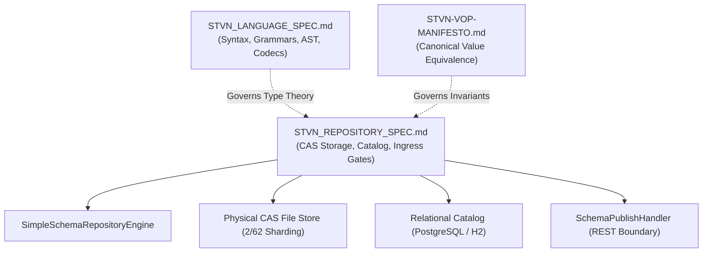
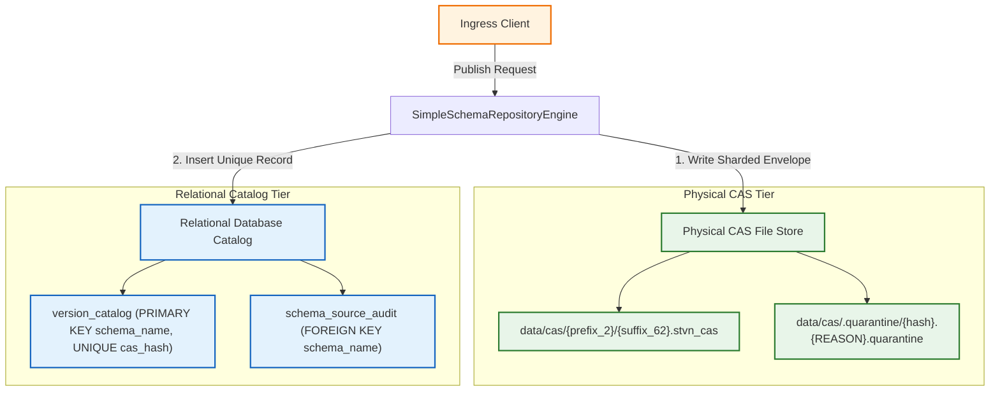
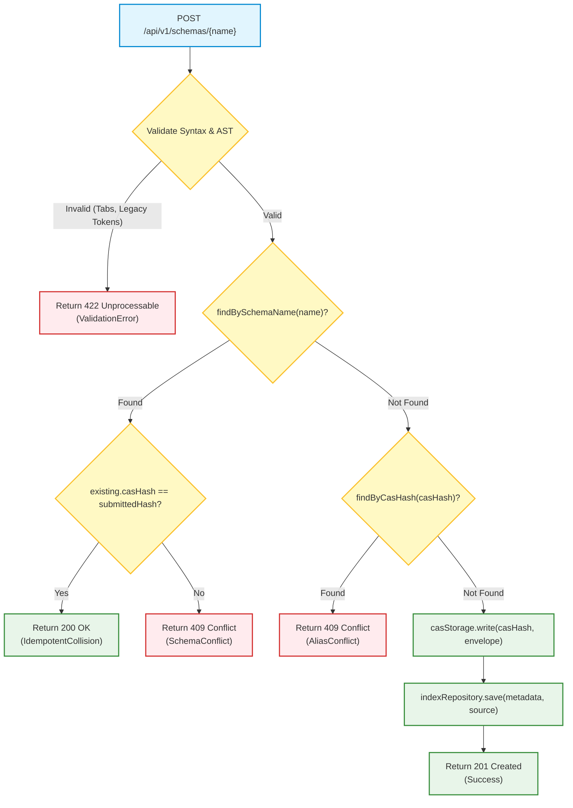

# STVN Architecture Specification: Schema Repository Server & CAS Catalog Invariants

**Document ID:** `STVN-SPEC-REPO-02`  
**Status:** Canonical Architecture Specification  
**Version:** `1.0.0-PROPOSAL`  
**Target Repository:** `ij_stvnadore_repository` (`stvnadore-repository`)  
**Target Version Baseline:** `2.0.0-PROPOSAL`  
**Governing Standard:** Simplified Technical English (STE-01 through STE-07)  
**Foundational Baselines:** `STVN_LANGUAGE_SPEC.md` (v1.3.1), `STVN-VOP-MANIFESTO.md`  

---

## 1. Scope & Ecosystem Authority

### 1.1 The Ecosystem Role of the Schema Repository

The STVN Schema Repository (`stvnadore-repository`) provides authoritative Content-Addressable Storage (CAS) and relational indexing services for the Strongly Typed Value Notation (STVN) ecosystem. The repository acts as the single source of truth for compiled schemas, nominal type declarations, and binary wire framing contracts.



### 1.2 Division of Architectural Authority

The STVN ecosystem divides architectural governance between two authoritative specifications:

1. **`STVN_LANGUAGE_SPEC.md` Governance Scope:**
   - Syntax and formal ANTLR grammar definitions (`StvnLexer.g4`, `StvnParser.g4`).
   - Abstract Syntax Tree (AST) definitions, intermediate representations (`StvnValue`), and lowering rules.
   - Standard library prelude declarations (`:org/stvnadore/prelude/*`).
   - Binary serialization strategies (`BinaryEncodingStrategy`), Byte 4 framing, and memory-mapped reader APIs.

2. **`STVN_REPOSITORY_SPEC.md` Governance Scope:**
   - Physical Content-Addressable Storage (CAS) envelope formatting and sharded directory layouts.
   - Relational catalog schema design, primary keys, and unique constraint invariants.
   - HTTP ingress boundary gates, payload sanitization, capacity bounds, and diagnostic status mappings.
   - Nominal identity hashing and the Nominal Bijectivity Invariant ($1:1$ Law).
   - Forensic recovery, projection sweeping, and quarantine protocols.

---

## 2. The Nominal Bijectivity Invariant ($1:1$ Law)

### 2.1 The Bijectivity Theorem

In the STVN ecosystem, nominal typing makes schema identity an intrinsic component of the schema value. Physical wire formats, specifically Binary Encoding Strategy `0x7` (`ExplicitSha256`), transmit a 32-byte cryptographic hash in the stream header to identify the framing schema. Wire decoders resolve the schema by looking up this hash in the repository.

To guarantee deterministic wire decoding and prevent type confusion, the repository enforces a strict bijection between nominal schemas and CAS hashes:

$$f: \text{NominalSchema} \longleftrightarrow \text{CAS Hash}$$

Under this theorem:
1. Every distinct nominal schema maps to exactly one deterministic SHA-256 CAS hash.
2. Every SHA-256 CAS hash maps to exactly one authoritative nominal schema name.

### 2.2 Opaque Nominal Preimage Invariant

Two schemas with identical physical layouts but distinct nominal type names must produce distinct CAS addresses. For example:

```stvn
# Schema A: UserIdentity.stvn_inclf
{
  :defs {
    :UserId { #size 64 #unsigned } :Int
  }
}
```

```stvn
# Schema B: AccountIdentity.stvn_inclf
{
  :defs {
    :AccountId { #size 64 #unsigned } :Int
  }
}
```

Both schemas define a 64-bit unsigned integer. However, `:UserId` and `:AccountId` represent distinct domain concepts. 

The repository mandates that `StvnSchemaHasher` and `StvnSchemaFlattener` incorporate the fully qualified nominal identifier, namespace path, and metadata facets into the SHA-256 digest preimage. Nominal brand wrappers must never undergo structural erasure. Consequently:

$$\text{SHA-256}(\text{UserIdentity.stvn\_inclf}) \neq \text{SHA-256}(\text{AccountIdentity.stvn\_inclf})$$

### 2.3 Binary Strategy `0x7` Resolution Invariant

Binary Strategy `0x7` wire framing requires exact schema resolution. When a decoder receives a binary payload with Byte 4 Bit 7 set and an `ExplicitSha256` header, the decoder executes:

$$\text{GET /api/v1/schemas/cas/}\{hash\}$$

The endpoint must return the exact schema associated with that hash. If the repository permitted multiple nominal schema names to register the same content hash, the resolution would become non-deterministic. Non-deterministic resolution violates Value-Oriented Programming (VOP) Canonical Equivalence and causes deserialization failures.

---

## 3. Dual-Tier Storage Architecture

The repository coordinates two persistence tiers: the immutable physical Content-Addressable Storage (CAS) tier and the relational metadata catalog tier.



### 3.1 Physical CAS Storage Tier

The physical CAS tier stores immutable schema envelope files on the filesystem.

#### 3.1.1 2/62 Hexadecimal Sharding Layout
CAS addresses consist of 64-character lowercase hexadecimal SHA-256 digests. To avoid filesystem directory scaling limits, the storage engine partitions files into a two-level hierarchy:
- **Prefix Directory:** The first 2 characters of the hash (`[0-9a-f]{2}`).
- **Payload File:** The remaining 62 characters of the hash with the `.stvn_cas` extension (`[0-9a-f]{62}.stvn_cas`).

```
<CAS_ROOT>/
├── 4a/
│   └── 1f8b3c...e890.stvn_cas
├── 7b/
│   └── 09c2a1...4412.stvn_cas
└── .quarantine/
    └── 9e...11.CORRUPT_ENVELOPE.quarantine
```

#### 3.1.2 CAS Envelope Document Format
Physical CAS files do not store bare source code. Files store an authoritative STVN document called the CAS envelope. The envelope records the nominal schema filename, verification tag, and source code:

```stvn
{
  :defs {
    :SchemaName :String
    :StvnInclf { #preserveIndent } :String
  }
  :type :Tuple(:SchemaName :StvnInclf)
  :body (
    "customer_profile.stvn_inclf"
    """[SHA256-4a1f8b3c...e890]
{
  :defs {
    :CustomerId { #size 64 #unsigned } :Int
    :CustomerName { #minSize 1 #maxSize 128 } :String
  }
}
    [SHA256-4a1f8b3c...e890]"""
  )
}
```

Envelope documents conform to STVN 2.0.0 metadata facet standards. Sizing facets are prohibited on `:String`. The envelope uses the bare flag `{ #preserveIndent } :String`.

### 3.2 Relational Catalog Tier

The relational catalog indexes schema identities to support fast metadata queries and enforce ecosystem uniqueness constraints.

#### 3.2.1 Table: `version_catalog`
The `version_catalog` table maintains the active index of registered schemas:

```sql
CREATE TABLE IF NOT EXISTS version_catalog (
    schema_name      VARCHAR(255) NOT NULL,
    shape_signature  TEXT         NOT NULL,
    cas_hash         VARCHAR(64)  NOT NULL,
    created_at       TIMESTAMP WITH TIME ZONE DEFAULT CURRENT_TIMESTAMP,
    CONSTRAINT pk_version_catalog PRIMARY KEY (schema_name),
    CONSTRAINT uq_version_catalog_cas_hash UNIQUE (cas_hash)
);

CREATE INDEX IF NOT EXISTS idx_version_catalog_shape ON version_catalog (shape_signature);
```

#### 3.2.2 Mandate for `uq_version_catalog_cas_hash`
The `CONSTRAINT uq_version_catalog_cas_hash UNIQUE (cas_hash)` constraint is mandatory. It enforces the Nominal Bijectivity Invariant ($1:1$ Law) at the database tier:
1. **Namespace Spoofing Prevention:** Prevents a malicious actor from publishing an existing schema's content under an unauthorized schema name.
2. **Alias Hijacking Defense:** Ensures that a single cryptographic hash maps to exactly one nominal schema name.
3. **Deterministic Wire Resolution:** Guarantees that downstream binary decoders resolve Strategy `0x7` wire frames to a unique schema.

#### 3.2.3 Table: `schema_source_audit`
The `schema_source_audit` table maintains an immutable historical audit log of every publish attempt:

```sql
CREATE TABLE IF NOT EXISTS schema_source_audit (
    audit_id         BIGINT GENERATED ALWAYS AS IDENTITY PRIMARY KEY,
    schema_name      VARCHAR(255) NOT NULL,
    cas_hash         VARCHAR(64)  NOT NULL,
    source_text      TEXT         NOT NULL,
    created_at       TIMESTAMP WITH TIME ZONE DEFAULT CURRENT_TIMESTAMP,
    CONSTRAINT fk_schema_source_audit_schema FOREIGN KEY (schema_name)
        REFERENCES version_catalog (schema_name) ON DELETE RESTRICT
);

CREATE INDEX IF NOT EXISTS idx_schema_source_audit_hash ON schema_source_audit (cas_hash);
```

---

## 4. Ingress State Machine & Conflict Calculus

When a client submits a schema to `POST /api/v1/schemas/{name}`, the repository executes the Ingress State Machine.



### 4.1 Ingress Conflict Calculus Matrix

The table below specifies the outcome for every combination of `schema_name` and `cas_hash` in `version_catalog`:

| Existing `schema_name` | Existing `cas_hash` | Outcome Variant | HTTP Status | Relational Action | Explanation |
|:---|:---|:---|:---|:---|:---|
| **Absent** | **Absent** | `PublishResult.Success` | `201 Created` | Insert catalog row; write CAS envelope blob. | New unique schema registered successfully. |
| **Present** | **Identical** | `PublishResult.IdempotentCollision` | `200 OK` | No database write; return existing metadata. | Re-submitting identical schema is an idempotent success. |
| **Present** | **Different** | `PublishResult.SchemaConflict` | `409 Conflict` | Reject; rollback transaction. | Schemas are immutable. Updating existing names is prohibited. |
| **Absent** | **Present** | `PublishResult.AliasConflict` | `409 Conflict` | Reject; rollback transaction. | CAS hash already claimed by another schema name ($1:1$ Law violation). |
| **N/A** | **Corrupt / Invalid** | `PublishResult.ValidationError` | `422 Unprocessable` | Reject; zero disk or database modifications. | Schema failed compiler or structural validation gates. |

---

## 5. Ingress Filter & Presentation Sanitization

The repository enforces a multi-stage defense perimeter before computing digests or touching persistence tiers.

### 5.1 Perimeter Capacity Bounds
Ingress handlers reject payloads exceeding `StvnStringCapacityUtils.DEFAULT_UNBOUNDED_STRING_CAPACITY` ($16\text{ MiB} = 16{,}777{,}216\text{ bytes}$) with HTTP 422:
```json
{
  "error": "Capacity Overflow",
  "message": "ERR_CAPACITY_OVERFLOW: Payload exceeds maximum allowed capacity: 16777216 units"
}
```

### 5.2 Filename Extension Hygiene
Schema filenames must strictly end with the `.stvn_inclf` extension. Non-compliant filenames are rejected with HTTP 422:
```json
[
  {
    "message": "ERR_MALFORMED_SCHEMA_IN_ENVELOPE: Schema filename must strictly end with '.stvn_inclf': invalid_name.stvn",
    "line": 1,
    "column": 1
  }
]
```

### 5.3 Headless Fail-Closed Semantic Compilation
The repository executes `StvnCompiler.compileToResult(sourceText, schemaName, StvnParserConfig.STRICT)` before AST inspection:
1. **Zero-Tab Invariant:** Source text containing raw horizontal tab characters (`\t`, `U+0009`) emits `ERR_TAB_CHARACTER_FORBIDDEN` at the exact character coordinate.
2. **Legacy Compound Token Rejection:** The compiler intercepts legacy 1.x keywords and emits `ERR_LEGACY_COMPOUND_TOKEN_DEPRECATED` with prescriptive v2.0.0 migration guidance:
   - `:Int32` $\rightarrow$ `{ #size 32 } :Int`
   - `:Uint16` $\rightarrow$ `{ #unsigned #size 16 } :Int`
   - `:FloatExact` $\rightarrow$ `{ #exact } :Float`
   - `:StringFixed36` $\rightarrow$ `{ #minSize 36 #maxSize 36 } :String`
   - `:StringNonEmpty` $\rightarrow$ `{ #minSize 1 } :String`
   - `:SeqNonEmpty` $\rightarrow$ `{ #minSize 1 } :Seq`
   - `:MapInv` $\rightarrow$ `{ #invertible } :Map`
   - `:TimeEpochMs` $\rightarrow$ `{ #unit #ms } :org/stvnadore/prelude/TimeEpoch`
   - `:DateTimeOffset` $\rightarrow$ `{ #offset } :org/stvnadore/prelude/DateTime`
3. **String Cardinality Governance (MCT § 3.1.3):** Applying `#size` to `:String` emits `ERR_INVALID_METADATA_FACET`. String bounds require `#minSize` and `#maxSize`.
4. **Temporal Consolidation Governance (MCT § 3.3):** Omitting `#unit` on `:TimeEpoch` or mode facets on `:DateTime` emits `ERR_MISSING_TEMPORAL_FACET`.
5. **Discrete Bound Kind Governance:** Declaring `#maxIncl` or `#minExcl` on discrete types emits `ERR_DISCRETE_BOUND_KIND_PROHIBITED`.

### 5.4 Flat Schema AST Structure Invariant
Schemas published to the repository must declare flat definitions only:
- The root document must contain strictly a `:defs` section.
- Top-level `:type` and `:body` sections are prohibited.
- `:include` directives inside flat schemas are prohibited (`ERR_INCLUDES_PROHIBITED_IN_FLAT_DOCUMENT`).

---

## 6. Forensic Reconciliation & Projection Sweeper

The repository includes a background worker (`RelationalProjectionSweeper`) to reconcile on-disk CAS files with the relational catalog.

### 6.1 Sweeper Reconciliation Lifecycle

The projection sweeper operates on a virtual thread:
1. **Directory Enumeration:** Scans `<CAS_ROOT>` and enumerates all `.stvn_cas` files.
2. **Index Check:** Checks `indexRepository.existsByHash(casHash)`. If present, skips the file.
3. **Envelope Parsing:** Reads the physical envelope and unpacks `(schemaName, innerSourceText)`.
4. **Validation Re-run:** Compiles `innerSourceText` using `StvnCompiler.compileToResult(STRICT)`.
5. **AST Verification:** Verifies AST structure invariants and recalculates the flattened SHA-256 digest.
6. **Hash Confirmation:** Compares the computed digest with the filename hash.
7. **Projection Restoration:** If valid, writes the restored record to `version_catalog` and `schema_source_audit`.

### 6.2 Forensic Quarantine Isolation

If a file in CAS storage fails any verification step, the sweeper isolates the file immediately. The sweeper moves the file to `<CAS_ROOT>/.quarantine/` using an atomic file move:

$$\text{<CAS\_ROOT>/.quarantine/<suffix\_62>.stvn\_cas.<timestamp>.<REASON>.quarantine}$$

#### Quarantine Failure Reasons:
- `EMPTY_PAYLOAD`: Physical file contains zero bytes.
- `CORRUPT_ENVELOPE`: File failed STVN envelope parsing.
- `INVALID_TUPLE_FORMAT`: Envelope structure does not match `:Tuple(:SchemaName :StvnInclf)`.
- `INVALID_FILENAME_EXTENSION`: Embedded schema name does not end with `.stvn_inclf`.
- `INVALID_INNER_AST`: Inner schema failed semantic compilation.
- `ILLEGAL_INCLUDES_IN_FLAT_SCHEMA`: Inner schema contains prohibited `:include` directives.
- `MALFORMED_INNER_STRUCTURE`: Inner schema contains top-level `:type` or `:body`.
- `FLATTENING_ERROR`: Flattening engine failed to produce canonical shape signature.
- `HASH_MISMATCH`: Recalculated SHA-256 digest does not match the physical filename hash.

---

## 7. Compliance Verification Checklist

Implementations of `stvnadore-repository` must satisfy this verification checklist to achieve compliance with `STVN-SPEC-REPO-02`:

- [ ] **Check 1 (Nominal Bijectivity):** Enforce `CONSTRAINT uq_version_catalog_cas_hash UNIQUE (cas_hash)` in database DDL.
- [ ] **Check 2 (Alias Conflict Pre-check):** Check `findByCasHash(casHash)` during publication. Return `PublishResult.AliasConflict` (HTTP 409) if hash exists under a different name.
- [ ] **Check 3 (Idempotent Collision):** Return `PublishResult.IdempotentCollision` (HTTP 200) only when both schema name and hash match.
- [ ] **Check 4 (Schema Mutation Conflict):** Return `PublishResult.SchemaConflict` (HTTP 409) when schema name exists with a different hash.
- [ ] **Check 5 (Fail-Closed Intake):** Reject raw tabs, legacy compound tokens, and `#size` on `:String` with HTTP 422.
- [ ] **Check 6 (Envelope Modernization):** Package envelopes using `{ #preserveIndent } :String`.
- [ ] **Check 7 (Forensic Quarantine):** Relocate corrupt or tampered CAS files to `.quarantine/` with diagnostic tags.
